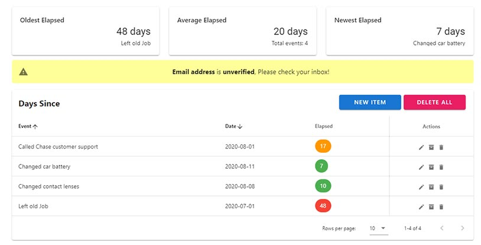

### vue-days-since:
Simple web application for tracking days elapsing since a particular date.Currently supports adding/editing/deleting and archiving events. Data is stored in a MongoDB on Atlas. 

Includes simple dashboard for oldest elapsed, average and newest

[Click here to see a Demo](https://vds.andywork.dev)

Note that you will need to register and login to see it.

### Requirements
* Backend is on a MongoDB database on atlas (theoretically you can host your own instance and host this internally if you don't want a public facing instance)
* Setup on Auth0 for login

### Backend Project:
py-vds-flask - Flask based backend which utilizes MongoDB to store Data. Data is secured with Auth0. 

### Dependencies
Auth0: Used for login authentication which requires Python 2